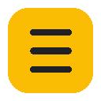

  

<h1 align="center">Add to NotebookLM</h1>

  Chrome-расширение для удобной работы с Google NotebookLM. 
  Добавляйте веб-страницы, YouTube-видео, комментарии и целые плейлисты в нотбуки — в один клик.

---

## О проекте

Add to NotebookLM — это расширение для Google Chrome, которое ускоряет работу с [NotebookLM](https://notebooklm.google.com). Вместо ручного копирования ссылок и загрузки файлов расширение добавляет контент прямо из браузера: одной кнопкой в popup, контекстным меню или массовым импортом.

Проект создан [@AndyShaman](https://github.com/AndyShaman), развивается как open-source. Текущая версия: **1.2.0**.

**Ключевые особенности:**
- Работает без официального API NotebookLM — использует внутренний RPC-клиент Google
- Не требует API-ключей для YouTube — InnerTube API для комментариев и метаданных
- Добавление выделенного текста как текстового источника с метаданными
- Массовый импорт: ссылки, вкладки, плейлисты, каналы
- Полная поддержка русского и английского языков

## Возможности

**Основное**
- Добавление текущей страницы в нотбук одним кликом
- **Захват страницы как PDF** — полный снимок страницы через Chrome Debugger API, загрузка в NotebookLM как PDF-источник
- **Добавление выделенного текста** — выделите текст на любой странице → ПКМ → добавление в нотбук как текстовый источник с метаданными
- Создание новых нотбуков прямо из расширения

**YouTube**
- Добавление видео, плейлистов и каналов целиком
- **Парсинг комментариев** — загрузка топ/новых комментариев с ответами, отправка в нотбук как текстовый источник

**Инструменты**
- Массовый импорт ссылок
- Импорт открытых вкладок браузера
- **Массовое удаление источников** из нотбука
- **Синхронизация Google Drive-источников** (Docs, Sheets)

**Настройки**
- Поддержка нескольких Google-аккаунтов
- Тёмная тема
- Русский и английский интерфейс

## Установка

1. Скачайте или клонируйте репозиторий
2. Откройте `chrome://extensions/`
3. Включите «Режим разработчика»
4. Нажмите «Загрузить распакованное расширение»
5. Выберите папку с расширением

## Использование

1. Войдите в [NotebookLM](https://notebooklm.google.com)
2. Нажмите на иконку расширения
3. Выберите нотбук и нажмите «Добавить в нотбук»

### Добавление как PDF

Кнопка «Добавить как PDF» делает полный снимок страницы и загружает его в NotebookLM как PDF-источник. Используйте для длинных статей и страниц с динамическим контентом, где обычное добавление по URL даёт неполный результат.

### YouTube

| Страница | Действие |
|----------|----------|
| Видео | Добавляет текущее видео |
| Плейлист | Добавляет все видео из плейлиста |
| Канал | Добавляет видимые видео с канала |
| Видео (комментарии) | Парсит и отправляет комментарии в нотбук |

## Лицензия

MIT — свободно используйте, модифицируйте и распространяйте.

**Приватность:** выделенный текст, URL и заголовок страницы отправляются в Google NotebookLM только после явного действия пользователя через контекстное меню.

**Авторы:** [@AndyShaman](https://github.com/AndyShaman) · [@perejaslav](https://github.com/perejaslav) · [add_to_NotebookLM](https://github.com/perejaslav/add_to_NotebookLM)

---

  

<h1 align="center">Add to NotebookLM</h1>

  Chrome extension for working with Google NotebookLM. 
  Add web pages, YouTube videos, comments, and entire playlists to your notebooks — in one click.

---

## About

Add to NotebookLM is a Google Chrome extension that speeds up working with [NotebookLM](https://notebooklm.google.com). Instead of manually copying links and uploading files, the extension adds content directly from the browser: one click in the popup, via context menu, or bulk import.

Created by [@AndyShaman](https://github.com/AndyShaman), open-source. Current version: **1.2.0**.

**Key features:**
- Works without the official NotebookLM API — uses Google's internal RPC client
- No API keys needed for YouTube — InnerTube API for comments and metadata
- Add selected text as a text source with page metadata
- Bulk import: links, tabs, playlists, channels
- Full Russian and English localization

## Features

**Core**
- Add current page to a notebook with one click
- **Capture page as PDF** — full page snapshot via Chrome Debugger API, uploaded to NotebookLM as a PDF source
- **Add selected text** — select text on any page → right-click → add to notebook as a text source with metadata
- Create new notebooks directly from the extension

**YouTube**
- Add videos, playlists, and entire channels
- **Parse comments** — fetch top/newest comments with replies, send to notebook as text source

**Tools**
- Bulk import links
- Import open browser tabs
- **Bulk delete sources** from notebooks
- **Sync Google Drive sources** (Docs, Sheets)

**Settings**
- Multiple Google account support
- Dark mode
- English and Russian interface

## Installation

1. Download or clone the repository
2. Open `chrome://extensions/`
3. Enable "Developer mode"
4. Click "Load unpacked"
5. Select the extension folder

## Usage

1. Login to [NotebookLM](https://notebooklm.google.com)
2. Click the extension icon
3. Select a notebook and click "Add to Notebook"

### Add as PDF

The "Add as PDF" button captures a full page snapshot and uploads it to NotebookLM as a PDF source. Use it for long articles and dynamic pages where regular URL import captures incomplete content.

### YouTube

| Page | Action |
|------|--------|
| Video | Adds current video |
| Playlist | Adds all videos from playlist |
| Channel | Adds visible channel videos |
| Video (comments) | Parses and sends comments to notebook |

## License

MIT — free to use, modify, and distribute.

**Privacy:** selected text, page URL and title are sent to Google NotebookLM only after an explicit user action via the context menu.

**Authors:** [@AndyShaman](https://github.com/AndyShaman) · [@perejaslav](https://github.com/perejaslav) · [add_to_NotebookLM](https://github.com/perejaslav/add_to_NotebookLM)
